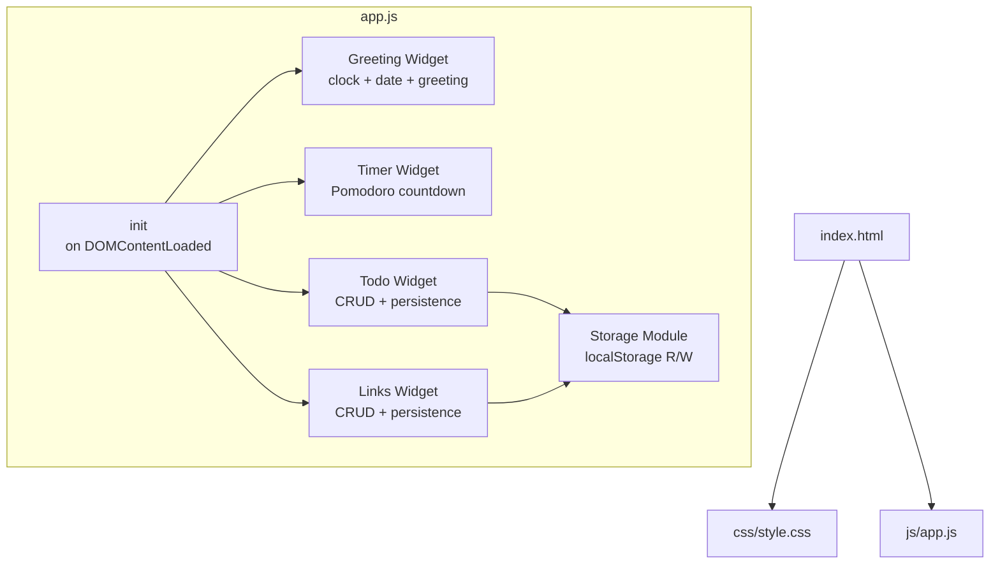

# Design Document

## Overview

The To-Do Life Dashboard is a single-page, client-side web application built with plain HTML, CSS, and vanilla JavaScript. It serves as a personal productivity homepage combining four widgets: a greeting/clock display, a Pomodoro focus timer, a persistent to-do list, and a quick-links launcher. All state is persisted in `localStorage` — no server, no build tools, no frameworks.

The app is a single `index.html` file referencing one `css/style.css` and one `js/app.js`. It runs entirely in the browser and is compatible with Chrome, Firefox, Edge, and Safari.

---

## Architecture

The application follows a simple **widget-based MVC pattern** within a single JS file. Each widget owns its own state slice, DOM references, and event handlers. A shared `Storage` module handles all `localStorage` reads and writes.



**Key design decisions:**
- No module bundler — all code lives in one IIFE-wrapped `app.js` to avoid global namespace pollution while staying compatible with plain `<script>` tags.
- Widgets communicate only through the DOM and shared `Storage` — no global event bus needed at this scale.
- `setInterval` drives both the clock (1 s) and the timer countdown (1 s); they are independent intervals.

---

## Components and Interfaces

### Storage Module

Centralizes all `localStorage` access. Wraps reads/writes in `try/catch` to satisfy Requirement 9.

```js
Storage.get(key)          // returns parsed JSON or null on error
Storage.set(key, value)   // serializes to JSON; silently fails on error
```

Keys:
- `"tld_tasks"` — JSON array of Task objects
- `"tld_links"` — JSON array of Link objects

### Greeting Widget

- Runs a `setInterval` every 1000 ms.
- On each tick: reads `new Date()`, formats time (HH:MM:SS), formats date (weekday + month + day + year), computes greeting bucket from `getHours()`.
- Writes directly to three DOM text nodes — no re-render of surrounding markup.

Interface (internal):
```js
GreetingWidget.init()   // attaches interval, does first render immediately
```

### Timer Widget

State: `{ remaining: 1500, running: false, intervalId: null }`

Controls: Start, Stop, Reset buttons.

- **Start**: sets `running = true`, starts interval that decrements `remaining` each second and updates display. When `remaining === 0`, stops and fires alert.
- **Stop**: clears interval, sets `running = false`.
- **Reset**: calls Stop, sets `remaining = 1500`, updates display.
- Alert on completion: `document.title` flash + browser `Notification` API (with permission check) or fallback `alert()`.

Interface (internal):
```js
TimerWidget.init()
```

### Todo Widget

State: in-memory array of Task objects, kept in sync with `localStorage` on every mutation.

Operations:
- `addTask(description)` — validates non-empty/non-whitespace, creates Task, appends to array, persists, renders.
- `editTask(id, newDescription)` — validates, updates in array, persists, re-renders item.
- `toggleTask(id)` — flips `completed`, persists, re-renders item.
- `deleteTask(id)` — removes from array, persists, removes DOM node.
- `renderAll()` — called on load; renders all tasks from storage.

Interface (internal):
```js
TodoWidget.init()
```

### Links Widget

State: in-memory array of Link objects, kept in sync with `localStorage` on every mutation.

Operations:
- `addLink(label, url)` — validates non-empty label and valid URL, creates Link, persists, renders.
- `deleteLink(id)` — removes from array, persists, removes DOM node.
- `renderAll()` — called on load.

URL validation uses `new URL(input)` inside a `try/catch` — if it throws, the URL is invalid.

Interface (internal):
```js
LinksWidget.init()
```

---

## Data Models

### Task

```js
{
  id: string,          // crypto.randomUUID() or Date.now().toString()
  description: string, // non-empty, trimmed
  completed: boolean
}
```

Stored as a JSON array under key `"tld_tasks"`.

### Link

```js
{
  id: string,   // crypto.randomUUID() or Date.now().toString()
  label: string, // non-empty, trimmed
  url: string    // valid URL string
}
```

Stored as a JSON array under key `"tld_links"`.

### Timer State

Not persisted — resets to 25:00 on every page load (intentional; a Pomodoro session is per-session by design).

### Greeting State

Purely derived from `new Date()` — no storage needed.

---

## Correctness Properties

*A property is a characteristic or behavior that should hold true across all valid executions of a system — essentially, a formal statement about what the system should do. Properties serve as the bridge between human-readable specifications and machine-verifiable correctness guarantees.*

### Property 1: Time format is always HH:MM:SS

*For any* `Date` object, the time-formatting function SHALL return a string matching `HH:MM:SS` where each component is zero-padded to two digits and the values correctly reflect the hours, minutes, and seconds of that date.

**Validates: Requirements 1.1**

---

### Property 2: Date format always contains weekday, month, day, and year

*For any* `Date` object, the date-formatting function SHALL return a string that contains a full weekday name, a full month name, a numeric day, and a four-digit year.

**Validates: Requirements 1.2**

---

### Property 3: Greeting maps correctly to all 24 hours

*For any* integer hour in [0, 23], the greeting function SHALL return exactly one of "Good Morning", "Good Afternoon", "Good Evening", or "Good Night" according to the defined time buckets (Morning: 5–11, Afternoon: 12–17, Evening: 18–20, Night: 21–4).

**Validates: Requirements 1.3**

---

### Property 4: Timer decrement reduces remaining by exactly one

*For any* timer state where `remaining > 0` and `running = true`, after one timer tick the `remaining` value SHALL decrease by exactly 1.

**Validates: Requirements 2.2, 2.3**

---

### Property 5: Stop preserves remaining time

*For any* timer state with any `remaining` value and `running = true`, calling stop SHALL set `running = false` while leaving `remaining` unchanged.

**Validates: Requirements 2.4**

---

### Property 6: Reset always produces the initial state

*For any* timer state (any `remaining` value, any `running` flag), calling reset SHALL always produce `remaining = 1500` and `running = false`.

**Validates: Requirements 2.5**

---

### Property 7: Adding a valid task grows the list by one

*For any* task list and any non-empty, non-whitespace task description, calling `addTask` SHALL increase the task list length by exactly 1 and the new task SHALL appear in the list with the trimmed description.

**Validates: Requirements 3.2**

---

### Property 8: Whitespace-only input is always rejected

*For any* string composed entirely of whitespace characters (including the empty string), both `addTask` and `editTask` SHALL reject the input, leave the task list unchanged, and produce a validation message.

**Validates: Requirements 3.3, 4.4**

---

### Property 9: Task list state is always reflected in localStorage (round-trip)

*For any* sequence of task mutations (add, edit, toggle, delete), after each mutation the JSON stored in `localStorage` under `"tld_tasks"` SHALL deserialize to an array that is deeply equal to the current in-memory task array.

**Validates: Requirements 3.4, 4.5, 5.4, 6.3, 7.1, 7.2**

---

### Property 10: Edit pre-fills with current description and updates on confirm

*For any* task with any description, activating edit SHALL produce an input field whose value equals the current description; confirming with a non-empty value SHALL update the task's description to the trimmed new value.

**Validates: Requirements 4.2, 4.3**

---

### Property 11: Completion toggle is a round-trip

*For any* task with any `completed` state, toggling twice SHALL return the task to its original `completed` state.

**Validates: Requirements 5.2, 5.3**

---

### Property 12: Deleting a task removes it from the list

*For any* task list containing at least one task, deleting a task SHALL result in that task no longer appearing in the list and the list length decreasing by exactly 1.

**Validates: Requirements 6.2**

---

### Property 13: Adding a valid link grows the link list by one

*For any* link list and any non-empty label with a valid URL, calling `addLink` SHALL increase the link list length by exactly 1 and the new link SHALL appear as a clickable element.

**Validates: Requirements 8.2**

---

### Property 14: Invalid link input is always rejected

*For any* combination of empty label or malformed URL string, `addLink` SHALL reject the input, leave the link list unchanged, and produce a validation message.

**Validates: Requirements 8.3**

---

### Property 15: Deleting a link removes it from the list

*For any* link list containing at least one link, deleting a link SHALL result in that link no longer appearing in the list and the list length decreasing by exactly 1.

**Validates: Requirements 8.6**

---

### Property 16: Link list state is always reflected in localStorage (round-trip)

*For any* sequence of link mutations (add, delete), after each mutation the JSON stored in `localStorage` under `"tld_links"` SHALL deserialize to an array that is deeply equal to the current in-memory link array.

**Validates: Requirements 8.7, 8.8**

---

## Error Handling

| Scenario | Handling |
|---|---|
| `localStorage.getItem` throws or returns corrupted JSON | `Storage.get` catches the error, returns `null`; widget initializes with empty array |
| `localStorage.setItem` throws (e.g., quota exceeded) | `Storage.set` catches silently; in-memory state is still updated, UI continues working |
| `addTask` / `editTask` called with whitespace-only string | Rejected before any state mutation; inline `<span class="error">` shown near the input |
| `addLink` called with empty label or invalid URL | `new URL(input)` throws → caught; inline error shown; no state mutation |
| Timer reaches 0 | Interval cleared, `running = false`; `Notification` API used if permission granted, else `alert()` fallback |
| `crypto.randomUUID` unavailable (very old browsers) | Fallback to `Date.now().toString() + Math.random()` for ID generation |

---

## Testing Strategy

### Approach

This feature is a pure client-side JavaScript application with clear input/output functions (formatters, validators, state mutators). Property-based testing is well-suited for the formatting, validation, and state-mutation logic. Example-based unit tests cover UI structure and specific edge cases.

**PBT library**: [fast-check](https://github.com/dubzzz/fast-check) (runs in Node.js with jsdom, no build tools needed for tests).

### Unit Tests (example-based)

- Timer initializes to 25:00 on load
- Timer display updates after one tick
- Timer fires alert at 00:00
- Each task renders with edit, toggle, and delete controls
- Each link renders with a delete control and `target="_blank"` anchor
- Empty localStorage on load produces empty list with no error
- localStorage read failure produces empty list with no crash
- localStorage write failure leaves in-memory state intact

### Property Tests (fast-check, minimum 100 iterations each)

Each test is tagged with the property it validates:

```
// Feature: todo-life-dashboard, Property 1: Time format is always HH:MM:SS
// Feature: todo-life-dashboard, Property 2: Date format always contains weekday, month, day, year
// Feature: todo-life-dashboard, Property 3: Greeting maps correctly to all 24 hours
// Feature: todo-life-dashboard, Property 4: Timer decrement reduces remaining by exactly one
// Feature: todo-life-dashboard, Property 5: Stop preserves remaining time
// Feature: todo-life-dashboard, Property 6: Reset always produces the initial state
// Feature: todo-life-dashboard, Property 7: Adding a valid task grows the list by one
// Feature: todo-life-dashboard, Property 8: Whitespace-only input is always rejected
// Feature: todo-life-dashboard, Property 9: Task list state is always reflected in localStorage
// Feature: todo-life-dashboard, Property 10: Edit pre-fills and updates on confirm
// Feature: todo-life-dashboard, Property 11: Completion toggle is a round-trip
// Feature: todo-life-dashboard, Property 12: Deleting a task removes it from the list
// Feature: todo-life-dashboard, Property 13: Adding a valid link grows the link list by one
// Feature: todo-life-dashboard, Property 14: Invalid link input is always rejected
// Feature: todo-life-dashboard, Property 15: Deleting a link removes it from the list
// Feature: todo-life-dashboard, Property 16: Link list state is always reflected in localStorage
```

### Smoke Tests (manual)

- Dashboard loads and displays correct time within 1 second
- All UI interactions respond within 100 ms (visually verified)
- App works correctly in Chrome, Firefox, Edge, and Safari
